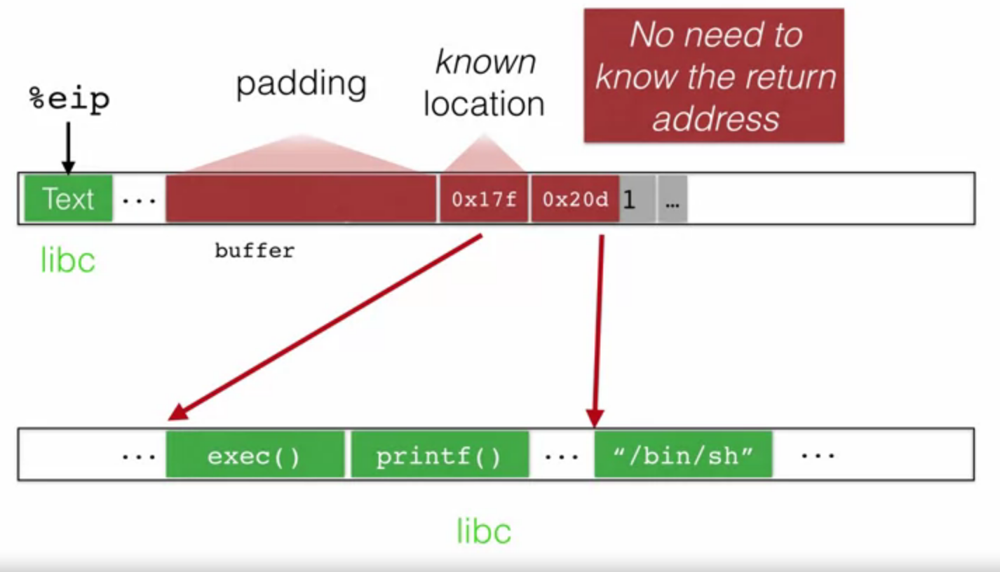

# Avoiding exploitation
Unfortunately programmers keep writing unsafe code. Here are some waits to still avoid exploits:
* __Make bug harder to exploit__: Make one or more steps in the exploitation process harder or impossible.
* __Avoid bug entirely__: 
    * Secure coding practices
    * Good code review and testing

eg: stack smashing attack
* putting attacker code into memory (no zeroes)
* Getting %eip to point to and run attacker code
* Finding the return address

-> making one of these steps more difficult
## Detecting overflows in the canaries
(example from cole mines, canary would die of gas) 
Place a canary in the program, if the %eip overruns the buffer, it will also overrun the canary code. Finally the code will look at the canary and determine if the canary has been changed or not. If this is the case, the compiler will abort.

### Canary values
How to find good values to use as canary:
1. __Terminator canary__: use CR's (carriage returns), LF (line feed), NUL,... which routines like `scnaf` can't deal with.
2. __Random canary__:
    * Write a random value at each process start
    * Save the real value somewhere in memory
    * Must write-protect the stored value
3. __Random XOR canary__: same as random canary but stores control info as canary XOR instead.

### Return-to-libc attack
This is an attack that can bypass a canary defense.
Overwrite return address to point in to some location in memory that has code that we want. Also override the next thing to be the argument to that in memory (eg: point return pointer to exec to create a new promise and next to /bin/sh) to make the current process into a shell.

### Defense against return-to-libc
Randomly place standard libraries and other elements in memory, make them harder to guess.
