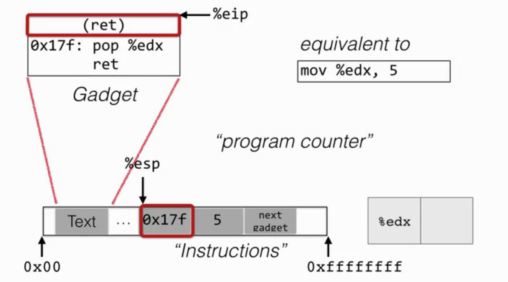

# Return Oriented Programming (ROP)
## Cat and mouse
* __Defense__: make stack/heap nonexecutable to prevent code-injection
    * __Attack__: return-to-libc
* __Defence__: Hide address of desired libc code or return address using ASLR (Address space layout randomization)
    * __Attack__: Brute force search or information leak
* __Defence__: Avoid using libc code entirely and use code in the program text instead.
    * __Attack__: Construct needed functionality using return oriented programming

## ROP
Rather than a single libc function to run shellcode, you _string together pieces of existing code, called gadgets_, to do it instead. the challenge here is to find the right gadgets and string them together.

### Approach
* Gadget = instruction groups that end with `ret` (return instruction)
* Stack serves as code:
    * `%esp` = program counter
    * Gadgets invoke via `ret` instruction
    * Gadgets get their arguments via `pop`

example: 

## How can we find gadgets to construct exploit?
There are enough gadgets to make a touring complete machine. Finding them can be automated by a search of the target binary for gadgets (find `ret`, search from back to front)

## Blind ROP
* __Defence__: Randomize the location of the code.
    * __Attack__: Blind ROP = if server restarts after crash, but does not re-randomize, we can:
        1. Read the stack to leak canaries and return addresses
        2. Find gadgets at run-time to effect call to write
        3. Dump binary to find gadgets for shellcode.

---
## Where does it end?
Best way to end cat and mouse is to have memory safety. This is easiest to achieve by using a memory-safe program.
