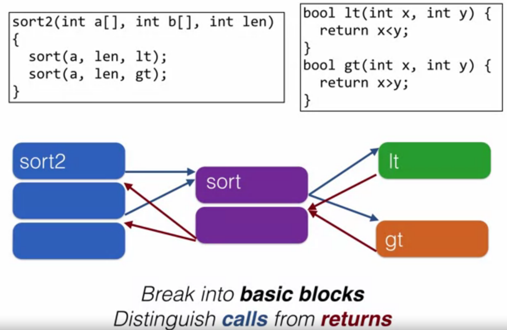

# Control Flow Integrity

## Behavior-based detection

The ultimate goal is to prevent malicious behavior. This can be achieved by observing the programs behavior and identify when a program has been compromised. If a deviation is detected, the program can intervene by stopping itself.  

In order to detect deviations we have to:

* Define "expected behavior"
* Detect deviations from expectation efficiently
* Avoid compromises of the detector

## Control-flow Integrity (CFI)

1. Define "expected behavior":
    Defined by Control flow graph (CFG)
2. Detect deviations from expectation efficiently:
    In-line reference monitor (IRM)
3. Avoid compromise of the detector:
    Sufficient randomness & immutability of the code.

### Problems with CFI

__Efficiency__:

* It causes a lot of __overhead__ (45% in the worst case, 16% on average)
* Not modular (can't handle dynamically linked libraries)

-> New type of CFI = Modular CFI (MCFI) fixes a lot of this overhead, but only works on C-language
  
__Security__:

* MCFI can eliminate 99.75% of ROP gadgets (on x64_64)
* Average Indirect-target Reduction (AIR) rules out 99% of ROP gadgets.

-> Security is pretty good

## Definition of expected behavior

Control Flow Graph:

